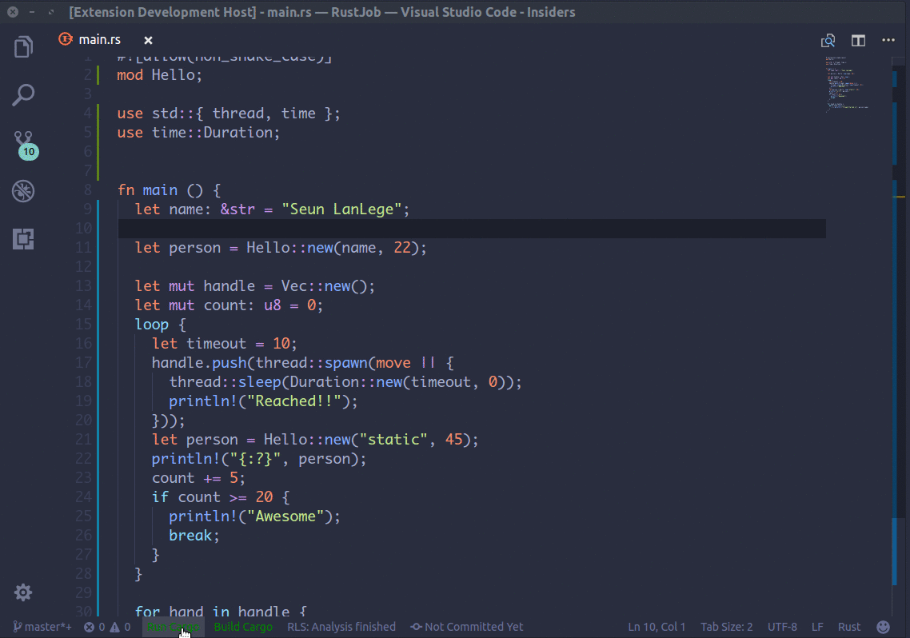

# Action Launcher

`Folked from Better Status Bar and fix some bugs`

Add customizable buttons to the status bar to execute actions or tasks in VS Code.

- Execute command with arguments
  - Ability to launche terminal with specific profile and open in Editor/Console area
- Adjust button location (with priority and alignment option)
- Execute command in terminal
- Execute VS Code command
  - Any command that can be activated via a keyboard shortcut can be activated via a button
- Ability to customize text color for each button
- Add icons to buttons
  - Icons can be added to buttons by using the Markdown icons-in-labels syntax. For example, to add an alert icon you include `$(alert) in the button name. See https://code.visualstudio.com/api/references/icons-in-labels for more info

### Example



## Installation and setup

- [X] Install the `Action Launcher` extension in your VS Code instance.
- [X] After installing, open your VS Code settings.json file.
- [X] Define the status bar buttons you want. Below is a sample configuration for reference.
- [X] Reload the VS Code window to see the new buttons. Alternatively, you can run the `Refresh Status Bar Buttons` command to refresh without reloading the window.

```json
{
  // Action Launcher settings
  "actionLauncher.defaultColor": "statusBar.foreground",
  "actionLauncher.configurationFile": false,
  "actionLauncher.loadNpmCommands": false,
  "actionLauncher.reloadButton": "♻️",
  "actionLauncher.commands": [
    {
        "id": "conda",
        "label": "$(snake)",
        "tooltip": "Conda",
        "command": "workbench.action.terminal.newWithProfile",
        "color": "orange",
        "alignment": 1,
        "priority": 9602,
        "useVsCodeApi": true,
        "args": [{
                "profileName": "Conda",
                "location": "editor"
            }]
    },
    {
        "id": "cygwin",
        "label": "$(terminal)",
        "tooltip": "Cygwin",
        "command": "workbench.action.terminal.newWithProfile",
        "color": "cyan",
        "alignment": 1,
        "priority": 9601,
        "useVsCodeApi": true,
        "args": [{
                "profileName": "Cygwin",
                "location": "editor"
            }]
    },
    {
      "id": "3",
      "label": "Git Status",
      "command": "git status",
      "tooltip": "STATUS",
      "color": "blue",
      "terminal": {
        "name": "test",
        "focus": false,
        "singleInstance": true,
        "clear": false
      }
    },
    {
      "id": "4",
      "label": "Git Status 2",
      "command": "git status",
      "alignment": 2,
      "priority": 1000,
      "terminal": {
        "name": "test",
        "focus": false,
        "singleInstance": true,
        "clear": false
      }
    },
    {
      "id": "split.editor",
      "label": "$(split-horizontal) Split editor",
      "command": "workbench.action.splitEditor",
      "color": "orange",
      "useVsCodeApi": true
    }
  ],
  "actionLauncher.dropdowns": [
    {
      "id": "5",
      "label": "Dropdown",
      "commands": ["status"],
      "options": {
        "placeholder": "temp",
        "ignoreFocusOut": true,
        "title": "temp"
      }
    }
  ]
}
```

## Configuration File

You can create a `statusBar.json` file to add the settings to a different place than the settings.json file.
The settings in `statusBar.json` overrides the `settings.json` properties.
The commands and dropdowns from `statusBar.json` and `settings.json` are combined.

## Keyboard Shortcuts

Keyboard Shortcuts can be set up for each of the commands/dropdowns that have been created.

- Go to File -> Preferences -> Keyboard Shortcuts to manually set keyboard shortcuts.
- Search for `ActionLauncher`.
  - If the commands are not available/correct, try refreshing the status bar buttons buttons or reloading the window.
- There should now be a list of commands with the specified ids (from settings.json).
- Set the desired keyboard shortcut.

## Config Vars

As seen in the previous example, vars such as `${file}` can be used. Below is a list of each of them and what they do.

- `workspaceFolder` - the path of the folder opened in VS Code
- `workspaceFolderBasename` - the name of the folder opened in VS Code without any slashes (/)
- `file` - the current opened file
- `relativeFile` - the current opened file relative to workspaceFolder
- `fileBasename` - the current opened file's basename
- `fileBasenameNoExtension` - the current opened file's basename with no file extension
- `fileDirname` - the current opened file's dirname
- `fileExtname` - the current opened file's extension
- `cwd` - the task runner's current working directory on startup
- `lineNumber` - the current selected line number in the active file
- `selectedText` - the current selected text in the active file
- `execPath` - the path to the running VS Code executable

## Credits

- [RobertOstermann](https://github.com/RobertOstermann/vscode-custom-commands) for the folked extension [Better Status Bar](https://github.com/RobertOstermann/vscode-custom-commands)
- [seunlanlege](https://github.com/seunlanlege) for the original extension [vscode-action-buttons](https://github.com/seunlanlege/vscode-action-buttons)
- [VSCode&#39;s Extension Samples](https://github.com/microsoft/vscode-extension-samples/tree/master/decorator-sample), which was a huge help to get started
- [All Contributors](../../contributors)
